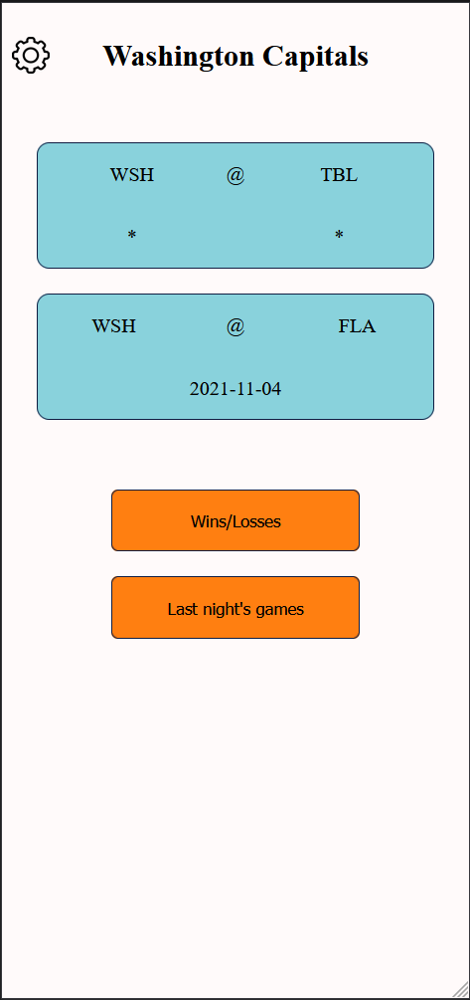

## Table of contents

- [Overview](#overview)
  - [The challenge](#the-challenge)
  - [Screenshot](#screenshot)
  - [Links](#links)
- [My process](#my-process)
  - [Built with](#built-with)
  - [Continued development](#continued-development)
- [Author](#author)

## Overview

### The challenge

School-project to build an app which:

- Uses an API
- Visualizes data in a graph
- Uses the DOM

### Screenshot

### Links

- Solution URL: [Solution](https://github.com/vikiorf/favouriteNhlTeam)
- Live Site URL: [Site](https://favourite-nhl-team.vercel.app/)

## My process

### Built with

- Semi-Semantic HTML5 markup
- Sass
- Flexbox
- CSS Grid
- Mobile-first workflow
- TypeScript

### Continued development

I really need to get better at designing apps.
I just don't seem to have any imagination whatsoever.

## Author

- Github - [@vikiorf](https://github.com/vikiorf)
